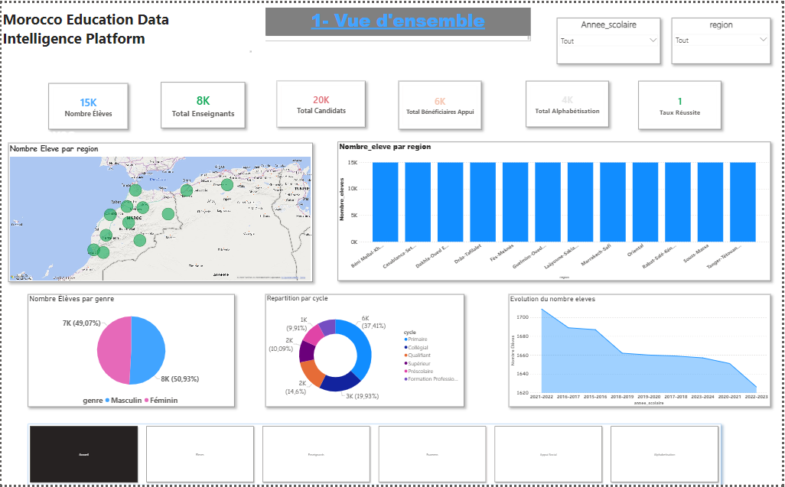
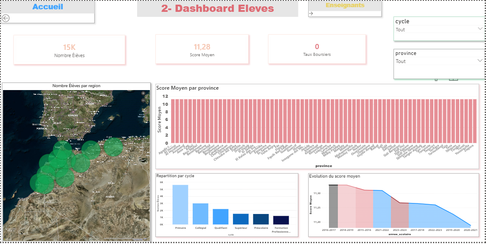
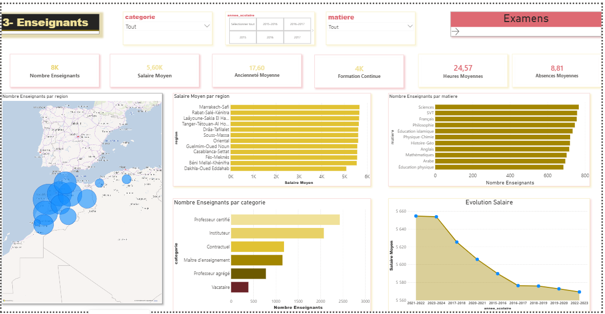
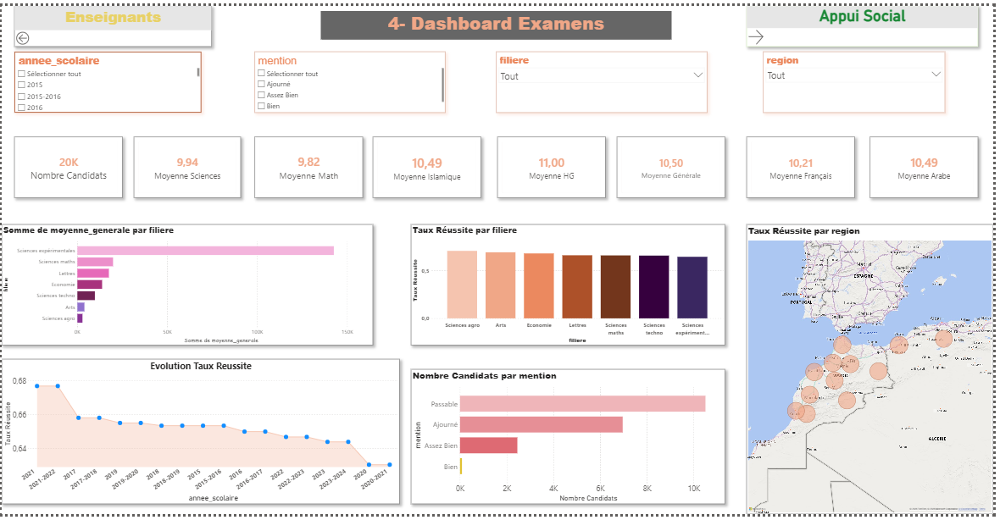
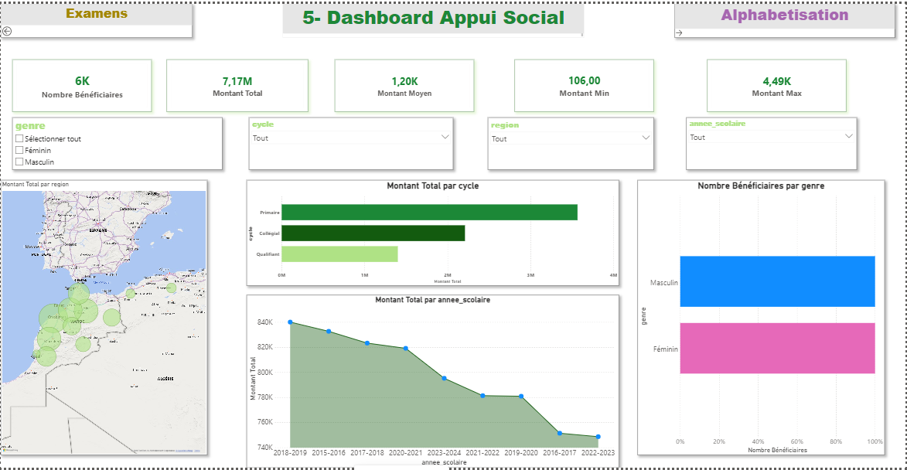
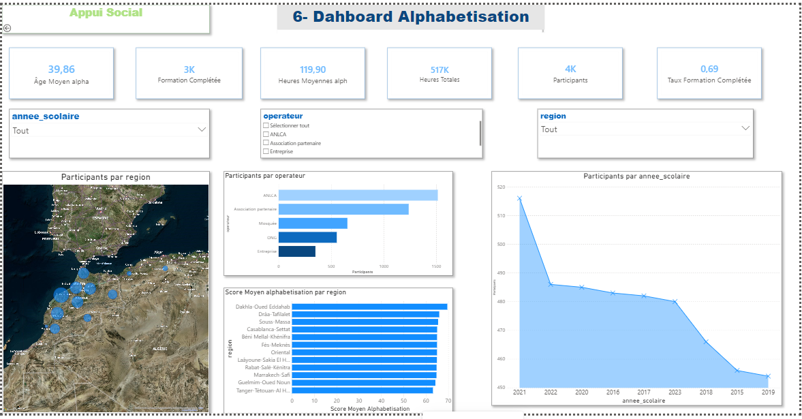

# 🎓 Morocco Education Data Intelligence Platform

A modern Business Intelligence and Data Engineering platform designed to analyze the Moroccan education system using a Lakehouse-inspired architecture.

---

## 📌 Project Overview

The **Morocco Education Data Intelligence Platform** centralizes educational data from multiple CSV sources into a modern analytics platform.

The project follows an **ELT architecture**, where raw data is stored in **MinIO**, transformed using **dbt**, organized into a **PostgreSQL Data Warehouse** (Bronze, Silver, Gold), and finally visualized with **Power BI** dashboards.

---

## 🎯 Objectives

- Centralize educational datasets
- Improve data quality
- Build a dimensional Data Warehouse
- Automate data transformation with dbt
- Create interactive Power BI dashboards
- Support educational decision-making through KPIs

---

# 🏗️ Architecture

```text
                    +------------------------+
                    |      CSV Datasets      |
                    +-----------+------------+
                                |
                                v
                    +------------------------+
                    |         MinIO          |
                    |      Data Lake         |
                    +-----------+------------+
                                |
                                v
                    +------------------------+
                    |      PostgreSQL        |
                    |       Bronze           |
                    +-----------+------------+
                                |
                                v
                    +------------------------+
                    |         dbt            |
                    |       Silver           |
                    +-----------+------------+
                                |
                                v
                    +------------------------+
                    |         dbt            |
                    |        Gold            |
                    +-----------+------------+
                                |
                                v
                    +------------------------+
                    |       Power BI         |
                    | Dashboards & KPIs      |
                    +------------------------+
```

---

# 🗂️ Data Sources

The platform integrates five educational datasets:

- 👨‍🎓 Students
- 👨‍🏫 Teachers
- 📝 National Exams
- 🤝 Social Support Programs
- 📚 Adult Literacy Programs

---

# 📊 Data Warehouse Design

## Bronze Layer

Raw data loaded from MinIO.

Tables

- bronze.eleves
- bronze.enseignants
- bronze.examens
- bronze.appui_social
- bronze.alphabetisation

---

## Silver Layer

Data cleaning and transformation.

Operations include:

- Remove duplicates
- Handle NULL values
- Standardize text
- Convert data types
- Data normalization
- Data validation

---

## Gold Layer

Business-ready dimensional model.

### Dimension Tables

- dim_date
- dim_region
- dim_province
- dim_cycle
- dim_genre
- dim_operateur

### Fact Tables

- fact_eleves
- fact_enseignants
- fact_examens
- fact_appui
- fact_alphabetisation

---

# 📈 Dashboards

The Power BI report contains six dashboards.

## 🏠 Executive Dashboard

Main KPIs

- Total Students
- Total Teachers
- Total Candidates
- Literacy Participants
- Social Support Beneficiaries
- National Success Rate

---

## 👨‍🎓 Students Dashboard

KPIs

- Total Students
- Average Score
- Dropout Rate
- Repetition Rate
- Scholarship Rate
- Boarding Access
- School Canteen Access

---

## 👨‍🏫 Teachers Dashboard

KPIs

- Total Teachers
- Average Salary
- Average Experience
- Training Rate
- Absence Days
- Weekly Teaching Hours

---

## 📝 Exams Dashboard

KPIs

- Candidates
- Admitted Students
- Success Rate
- Average Grade
- Mentions

---

## 🤝 Social Support Dashboard

KPIs

- Beneficiaries
- Total Amount
- Average Support

---

## 📚 Adult Literacy Dashboard

KPIs

- Participants
- Training Hours
- Average Score
- Completion Rate

---

# 🛠️ Technologies

| Category | Technology |
|----------|------------|
| Data Lake | MinIO |
| Database | PostgreSQL |
| ELT | dbt |
| Query Language | SQL |
| BI Tool | Power BI |
| Version Control | Git |
| Repository | GitHub |

---

# 📂 Project Structure

```text
Morocco-Education-Data-Intelligence-Platform/

│

├── data/
│   ├── eleves.csv
│   ├── enseignants.csv
│   ├── examens.csv
│   ├── appui_social.csv
│   └── alphabetisation.csv
│

├── dbt/
│   ├── models/
│   │   ├── bronze/
│   │   ├── silver/
│   │   └── gold/
│   │
│   ├── macros/
│   ├── snapshots/
│   └── tests/
│

├── powerbi/
│   └── Morocco_Education.pbix
│

├── sql/
│

├── docs/
│

├── images/
│

└── README.md
```

---

# 🚀 ETL Workflow

1. Upload CSV datasets to MinIO.
2. Load raw data into the Bronze schema.
3. Clean and transform data in the Silver layer using dbt.
4. Build dimensional models in the Gold layer.
5. Connect Power BI to the Gold schema.
6. Build dashboards and KPIs.

---

# 📊 Key Performance Indicators

## Students

- Total Students
- Average Score
- Dropout Rate
- Repetition Rate
- Scholarship Rate

---

## Teachers

- Average Salary
- Average Experience
- Training Rate
- Absence Rate

---

## Exams

- Success Rate
- Average Grade
- Number of Candidates
- Number of Admitted Students

---

## Social Support

- Total Beneficiaries
- Total Funding
- Average Funding

---

## Literacy

- Participants
- Training Hours
- Completion Rate
- Average Evaluation Score

---

# 📷 Dashboard Preview


```
images/

executive_dashboard.png



students_dashboard.png



teachers_dashboard.png



exams_dashboard.png


social_support_dashboard.png


literacy_dashboard.png

```

---

# 🌟 Project Highlights

- Modern ELT architecture
- Lakehouse-inspired workflow
- Automated transformations with dbt
- PostgreSQL Data Warehouse
- Star Schema modeling
- Interactive Power BI dashboards
- Educational KPI monitoring
- Scalable and maintainable solution

---

# 🔮 Future Improvements

- Automate pipeline orchestration with Apache Airflow.
- Deploy to Microsoft Azure or AWS.
- Integrate real-time data ingestion.
- Add Machine Learning models for predictive analytics.
- Publish dashboards using Power BI Service.
- Implement CI/CD for dbt models.

---

# 👩‍💻 Author

**Nouhaila Sabbar**

Data Analyst | Business Intelligence | Data Engineering

GitHub: https://github.com/nohasabb2005-spec

LinkedIn: https://www.linkedin.com/in/nouhaila-sabbar-85882a365/

---

# 📄 License

This project was developed for educational and academic purposes as a final-year project.

© 2026 Nouhaila Sabbar